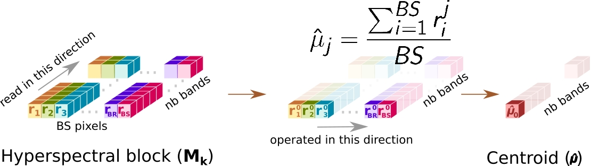

# Algoritmo de compresión con pérdidas HyperLCA

El compresor HLCA, desarrollado por el Instituto Universitario de Microelectrónica Aplicada de la Universidad de Las Palmas de Gran Canaria, es un compresor con pérdidas inspirado en el proceso Gram-Schmidt, que permite construir, a partir de un conjunto de vectores de un espacio vectorial con producto interno, otro conjunto ortonormal de vectores que genere el mismo subespacio vectorial. A continuación se detallan los pasos del algoritmo.

## 1. Obtención del pixel medio (û)
Se obtiene el pixel medio de la imagen sumando cada valor por banda y dividiendo dicho sumatorio por el tamaño del bloque (función *averagePixel*).

## 2. Centralizado del bloque (C)
Esta operación consiste en restar el píxel medio, calculado en la etapa anterior, a cada píxel hiperespectral del bloque (función *duplicateAndCentralized*). En este paso el bloque original se conserva.

## 3. Obtención de los vectores u y q, mediante el cálculo del brillo
Esta etapa consiste en recorrer el bloque centralizado C y obtener los brillos de cada uno de los pixeles que componen dicho bloque, seleccionando aquel cuyo valor es mayor para el calculo de los vectores ortogonales (función *brighness* y *quVectors*).

- Cálculo del brillo: 
	
$$ b_j = \sum_{i=nb}^{nb} (c_{i}^{2}) $$
	
Donde $b_j$ corresponde al cálculo del brillo de un pixel hiperespectral y $c_i$ al valor de la banda *i* del pixel *j*.

- Cálculo del vector q:
	
$$ q = c_{jmax} $$ 	

El vector *q* corresponde al píxel de mayot brillo

- Cálculo del vector u:
	
$$ u = \frac{q}{b_{jmax}} $$

El vector *u* corresponde al pixel con mayor brillo, cuyos valores de cada una de sus bandas ha sido dividido por el valor del brillo de dicho pixel.

## 4. Proyección de la imagen sobre el vector u (v)
El bloque hiperespectral es proyectado sobre el vector *u*, obteniendo la imagen proyectada en el vector *v*. Para dicha operación se realiza el producto escalar de uno de los pixeles de la imagen (*ri*) con el vector *u* (función *projectingImg*).

## 5. Sustracción de información
Se extrae la información mediante el producto escalar del vector q con el vector v (obtenido en el paso anterior), el cual es restado al pixel correspondiente del bloque hiperespectral (función *subtractingInformation*).

Los pasos 3 a 5 se repetirán 12 veces, introduciendo como entrada del paso 3 el resultado de la etapa 5 (imagen sustraída X) en lugar del bloque centralizado. Como salida, se deberá almacenar el centroid (û), los pixeles originales de los píxeles de mayor brillo y las proyecciones realizadas (vectores v).

Si deseas ampliar información sobre el algoritmo HyperLCA, puedes encontra dicha información en el siguente [enlace](https://www.mdpi.com/2072-4292/12/22/3741). Recordad que en este lab únicamente se realiza la fase de transformación espectral.

**Nota:** La imagen hiperespectral se encuentra almacenada en el siguiente [enlace](https://mega.nz/file/Z5JUkSoI#boptGx0TD4YU1FGz5WxVkxgB0-fav1sQiVVCk2lz_CA).

----

# HyperLCA Lossy Compression Algorithm

The HLCA compressor, developed by the Institute of Applied Microelectronics at the University of Las Palmas de Gran Canaria, is a lossy compressor inspired by the Gram-Schmidt process. It allows the construction of an orthonormal set of vectors, generating the same vector subspace from a set of vectors in a vector space with inner product. The following are the steps of the algorithm.

## 1. Centroid (û)
The mean pixel of the image is obtained by summing each band's value and dividing the sum by the block size (function *averagePixel*).

## 2. Centralized Block (C)
Esta operación consiste en restar el píxel medio, calculado en la etapa anterior, a cada píxel hiperespectral del bloque (función *duplicateAndCentralized*).

## 3. Obtaining vectors u and q through Brightness Calculation
This stage involves traversing the centered block C to obtain the brightness of each of the pixels composing the block, selecting the one with the highest value for the calculation of orthogonal vectors (functions *brightness* and *quVectors*).

- Brightness Calculation: 
	
$$ b_j = \sum_{i=nb}^{nb} (c_{i}^{2}) $$
	
Where $b_j$ corresponds to the brightness calculation of a hyperspectral pixel, and $c_i$​ is the value of band *i* of pixel *j*.

- Calculation of vector q:
	
$$ q = c_{jmax} $$ 	

The vector *q* corresponds to the pixel with the highest brightness.

- Calculation of vector u:
	
$$ u = \frac{q}{b_{jmax}} $$

The vector *u* corresponds to the pixel with the highest brightness, with the values of each of its bands divided by the brightness value of that pixel.

## 4. Projection (v)
The hyperspectral block is projected onto vector *u*, obtaining the image projected onto vector *v*. For this operation, the scalar product of one of the image pixels (*ri*) with vector *u* is performed (function *projectingImg*).

## 5. Subtraction
Information is extracted through the scalar product of vector *q* with vector *v* (obtained in the previous step), which is then subtracted from the corresponding hyperspectral block pixel (function *subtractingInformation*).

Steps 3 to 5 are repeated 12 times, using the result of stage 5 (subtracted image X) as input for stage 3, instead of the centered block. As output, the centroid (û), the original pixels with the highest brightness, and the performed projections (vectors *v*) must be stored.

If you wish to obtain more information about the HyperLCA algorithm, you can find it in the following [link](https://www.mdpi.com/2072-4292/12/22/3741). Please note that this lab only covers the spectral transformation phase.

**Note:** The hiperspectral image is stored in the following [link](https://mega.nz/file/Z5JUkSoI#boptGx0TD4YU1FGz5WxVkxgB0-fav1sQiVVCk2lz_CA).

